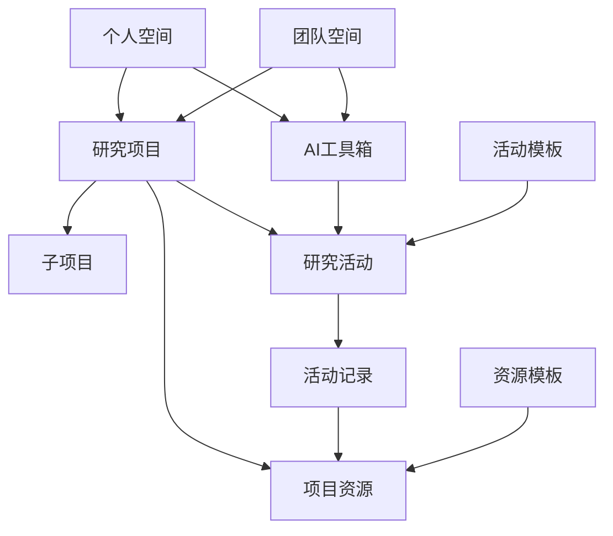

# ResearchPlus 平台架构设计

## 1. 核心概念

### 1.1 研究项目 (Research Project)
- 研究项目是最高层级的组织单位
- 可以包含多个子项目，支持层级组织
- 具有里程碑和时间线管理
- 可以与其他项目建立关联关系
- 包含多个研究活动、资源和团队成员
- 有明确的研究目标和时间线

### 1.2 研究活动 (Research Activities)
- 由研究工具产生的具体研究记录
- 支持活动模板，快速创建标准化工作流
- 可以独立存在或附属于特定项目
- 类型包括：
  - 文献阅读笔记
  - 数据分析报告
  - 实验记录
  - 论文写作
  - 专利申请
  - 基金申请
  - 算法开发
  - 等

### 1.3 AI 工具箱 (AI Toolbox)
- 提供专业的研究辅助工具
- 工具分类：
  - 文献工具（阅读、管理、分析）
  - 写作工具（论文、专利、基金）
  - 数据工具（分析、可视化）
  - 实验工具（设计、记录、分析）
  - 等
- 每个工具支持：
  - 活动记录生成
  - 模板定制
  - 工作流自动化
  - 多人协作

### 1.4 资源管理 (Resource Management)
- 研究过程中产生和使用的资源
- 支持版本控制和变更追踪
- 提供资源模板和标准化组织
- 资源类型：
  - 数据集
  - 模型
  - 文献库
  - 代码仓库
  - 实验记录
  - 文档资料
- 资源特性：
  - 版本控制
  - 使用追踪
  - 权限管理
  - 跨项目引用
  - 模板支持

### 1.5 协作空间 (Collaboration Space)
- 个人空间
  - 个人的研究项目
  - 个人的研究活动
  - 私人资源库
  - 自定义工作流
  - 个性化仪表盘
  
- 团队空间
  - 团队研究项目
  - 团队协作活动
  - 共享资源库
  - 成员管理
  - 权限控制
  - 团队工作流
  - 协作仪表盘

## 2. 工作流程

### 2.1 研究项目工作流
1. 创建研究项目/子项目
2. 设定研究目标和里程碑
3. 选择项目模板（可选）
4. 邀请团队成员（可选）
5. 使用AI工具开展研究活动
6. 管理研究资源
7. 追踪研究进度
8. 管理项目关联关系

### 2.2 研究活动工作流
1. 选择活动模板或自定义活动
2. 配置工具和参数
3. 开展具体研究活动
4. 自动记录活动过程
5. 生成研究记录
6. 关联到特定项目
7. 设置协作权限
8. 追踪活动进度

### 2.3 资源管理工作流
1. 创建/上传资源
2. 选择资源模板
3. 版本控制设置
4. 分类组织
5. 权限管理
6. 关联项目/活动
7. 共享协作
8. 使用追踪

## 3. 系统关系图



## 4. 权限与访问控制

### 4.1 个人权限
- 完全控制个人项目
- 管理个人研究活动
- 私有资源访问
- AI工具使用权限
- 模板定制权限

### 4.2 团队权限
- 项目级别权限
  - 所有者
  - 管理员
  - 成员
  - 访客
- 资源访问权限
  - 完全控制
  - 编辑权限
  - 评论权限
  - 只读权限
  - 无权限
- 模板管理权限
  - 创建/编辑模板
  - 使用模板
  - 查看模板

## 5. 数据关系

### 5.1 项目关系
- 项目 1:n 子项目
- 项目 1:n 研究活动
- 项目 1:n 资源
- 项目 n:n 成员
- 项目 n:n 关联项目

### 5.2 活动关系
- 活动 1:1 工具
- 活动 n:1 项目
- 活动 1:n 资源
- 活动 n:1 模板

### 5.3 资源关系
- 资源 n:1 项目
- 资源 n:n 活动
- 资源 n:n 用户
- 资源 n:1 模板
- 资源 1:n 版本

## 6. 用户界面组织

### 6.1 工作台
- 快速访问
  - 最近项目/活动
  - 常用工具
  - 重要通知
  - 待办任务
- 活动概览
  - 研究进度
  - 里程碑追踪
  - 协作动态
  - 重要指标
- 资源状态
  - 存储使用
  - 计算资源
  - API 配额
  - 版本统计

### 6.2 项目中心
- 项目概览
  - 基本信息
  - 进度追踪
  - 里程碑
  - 子项目
- 研究活动
  - 活动列表
  - 活动模板
  - 进度报告
- 项目资源
  - 资源库
  - 版本控制
  - 使用统计
- 成员协作
  - 成员管理
  - 权限设置
  - 协作记录

### 6.3 活动中心
- 活动管理
  - 活动列表
  - 模板管理
  - 工具配置
- 进度追踪
  - 时间线
  - 完成度
  - 协作状态
- 资源关联
  - 关联资源
  - 版本记录
  - 引用追踪

### 6.4 资源中心
- 资源库
  - 资源列表
  - 模板管理
  - 版本控制
- 分类管理
  - 目录结构
  - 标签系统
  - 检索工具
- 使用分析
  - 使用统计
  - 引用追踪
  - 存储分析

### 6.5 团队中心
- 团队概览
  - 基本信息
  - 项目统计
  - 活动动态
- 成员管理
  - 成员列表
  - 角色设置
  - 权限管理
- 资源共享
  - 共享资源
  - 使用统计
  - 权限控制
- 协作空间
  - 讨论区
  - 公告板
  - 文档库

## 7. 系统特性

### 7.1 模板系统
- 项目模板
  - 预设项目结构
  - 标准化工作流
  - 资源组织方案
- 活动模板
  - 常用活动流程
  - 工具配置方案
  - 记录规范
- 资源模板
  - 标准化组织
  - 元数据规范
  - 版本控制策略

### 7.2 版本控制
- 资源版本
  - 版本历史
  - 差异比较
  - 回滚机制
- 活动记录
  - 过程追踪
  - 变更历史
  - 协作记录

```